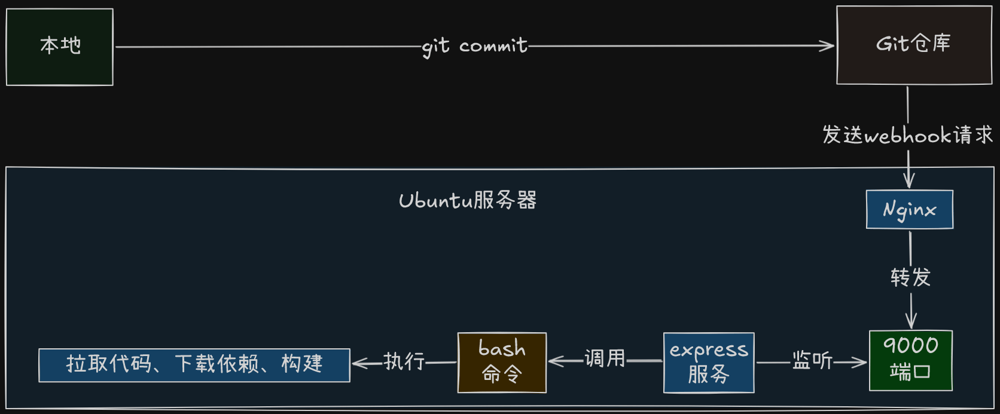
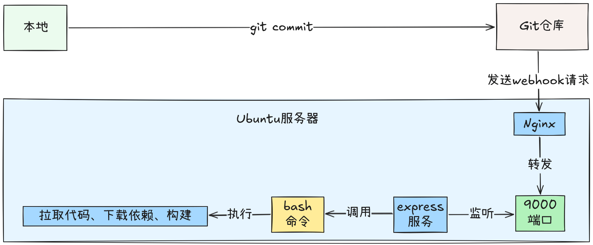
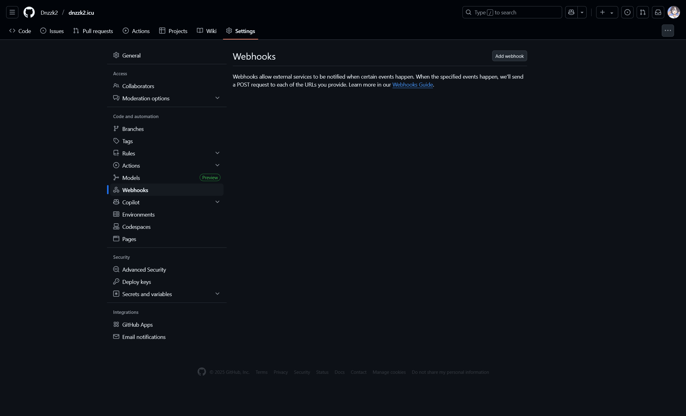
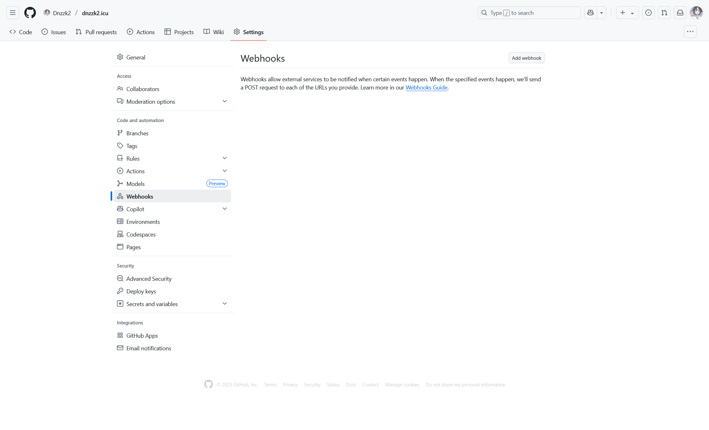

## 前言

本博客使用的是 :link[Astro]{id=https://astro.build/} 框架，使用静态模式生成的静态博客，这意味着博客内容，在构建的时候就已经固定了，需要更新内容的话，要重新构建。

如果使用的是 :link[Vercel]{id=https://vercel.com/} 或者 :link[Netlify]{id=https://www.netlify.com/} 部署，那么每次更新 Github 仓库的时候，都会自动触发一次构建，从而更新博客。

但是我把博客部署在了轻量云服务器上，这样就会出现一个问题，就是每次修改博客内容，都需要重新登录服务器，然后执行代码拉取、构建博客的，这样效率非常低，流程过于长。

这个时候就要请出 Github 的利器 [Webhooks](https://docs.github.com/en/webhooks) 来解决这个问题。

## Webhooks

Webhooks 是 Github 提供的自动化服务，支持在仓库内容变动时，向指定 URL 实时推送 `POST` 请求，实现无需人工干预的自动处理。

这是一种“被动推送”机制，这种推送机制的核心特点：

- 实时：事件发生后几乎立刻推送，无需轮询。
- 自动：无需人工干预，自动处理。
- 灵活：可以自定义接收端的处理逻辑。

## 流程

:::image-figure[流程自动化部署示意图]
(class:img-dark)

(class:img-light)
:::

通过上面的流程图，可以看到自动化部署的核心步骤：

1. Github 仓库内容变更（如 push、merge 等）；
2. Github Webhook 触发，向服务器发送 POST 请求；
3. 服务器接收 Webhook，执行自动化脚本（如拉取代码、安装依赖、构建、重启服务等）；
4. 部署完成，网站自动更新。

## 起飞

先从服务器开始，再到 Github 配置 webhook，先有服务，才能更好的配置。

### 准备工作

以下两种安装 `nodejs` 和 `npm`（已安装，可以忽略）的方法，选择其一即可。

- 普通安装方式：

```bash
sudo apt install nodejs npm -y
```

安装完后可以用下面命令检查版本：

```bash
node -v
npm -v
```

- 使用nvm安装：

```bash
# 安装 nvm
curl -o- https://raw.githubusercontent.com/nvm-sh/nvm/v0.39.7/install.sh | bash
# 重新加载 shell
source ~/.bashrc
# 安装最新版 node（会自带 npm）
nvm install node
```

### 建目录

目录都在放 `/var/www` 中，你可以用自己的目录替代，以下都以此目录为基准。

```txt title="目录结构"
www
├── project
├── webhooks
│   ├── log
│   ├── hookmain
│   └── sh
```

创建一个跟项目目录同级的 `/var/www/webhooks` 目录，用于放置 webhook 服务相关的文件和脚本。

```bash
cd /var/www
mkdir webhooks
```

创建三个子目录， `log`、`hookmain`、`sh`，log 用于保存日志，hookmain 用于存放 express 服务，sh 用于存放 bash 脚本。

```bash
cd webhooks
mkdir log
mkdir hookmain
mkdir sh
```

### 写脚本

进入 `sh` 目录，创建 `deploy.sh`:

```bash
cd sh
nano deploy.sh
```

写入以下内容：

```bash {"1. 替换为项目所在路径:":9}
#!/bin/bash
set -e

# 日志输出到指定目录
exec >> /var/www/webhooks/log/webhook.log 2>&1

echo "Starting deployment at $(date)"


cd /var/www/project
git pull origin master
npm install
npm run build

echo "Deployment completed at $(date)"
```

保存后赋予执行权限：

```bash
chmod +x /var/www/webhooks/sh/deploy.sh
```

### 写服务

进入 `hookmain` 目录，初始化 npm，并安装 express、dotenv：

```bash
cd hookmain
npm init -y
npm install express dotenv
```

创建 `.env` 文件，写入你的 GitHub Webhook 密钥（自定义，在创建 Webhook 时填写）

```bash
echo "WEBHOOK_SECRET=你的github密钥" > .env
```

创建 `index.js`，并写入以下内容：

```javascript title="index.js" {"1. 替换为你想设置的API名称:":20}  {"2. 替换为脚本所在的路径:":37} {"3. 替换为你想监听的端口，别忘记log中也要修改:":48}
require('dotenv').config()
const express = require('express')
const { exec } = require('child_process')
const crypto = require('crypto')
const app = express()

// 你在 GitHub 设置的密钥
const WEBHOOK_SECRET = process.env.WEBHOOK_SECRET

app.use(express.raw({ type: 'application/json' }))

// 验证签名函数
function verifySignature(signature, payload) {
  if (!signature) return false

  const expectedSignature = 'sha256=' + crypto.createHmac('sha256', WEBHOOK_SECRET).update(payload).digest('hex')

  return crypto.timingSafeEqual(Buffer.from(signature), Buffer.from(expectedSignature))
}

app.post('/API', (req, res) => {
  const signature = req.headers['x-hub-signature-256']
  const payload = req.body

  // 验证签名
  if (!verifySignature(signature, payload)) {
    console.log('Invalid signature, rejecting webhook')
    return res.status(401).send('Unauthorized')
  }

  console.log('Webhook verified and received at:', new Date())

  // 解析 JSON 数据
  const body = JSON.parse(payload.toString())
  console.log('Repository:', body.repository?.name)
  console.log('Pusher:', body.pusher?.name)

  exec('/var/www/webhooks/sh/deploy.sh', (error, stdout, stderr) => {
    if (error) {
      console.error('Deploy error:', error)
    } else {
      console.log('Deploy success:', stdout)
    }
  })

  res.send('Deployment triggered')
})

app.listen(9001, '127.0.0.1', () => {
  console.log('Webhook server running on port 9001')
})
```

### 启动服务

安装pm2，并启动服务，设置开机自启动：

```bash
npm install -g pm2

pm2 start index.js --name webhook-server
pm2 save
pm2 startup
```

### Nginx 反向代理

```nginx title="nginx.conf"  {"1. 替换为设置的API名称和端口:":4}
server {
    # 其他Nginx配置


    # 监听github的webhooks
    location /API {
    proxy_pass http://127.0.0.1:9001;
    proxy_http_version 1.1;
    proxy_set_header Host $host;
    proxy_set_header X-Real-IP $remote_addr;
    proxy_set_header X-Forwarded-For $proxy_add_x_forwarded_for;
    proxy_set_header X-Forwarded-Proto $scheme;
    }

    # 其他Nginx配置
}
```

### 设置 Webhooks

:::image-figure[webhooks]
(class:img-dark)

(class:img-light)
:::

1. 登录 GitHub，进入项目，点击 Settings，找到 Webhooks，点击 Add webhook。
2. 填写 Webhook URL，选择 Content type 为 application/json，输入 Secret（之前在 `.env` 中设置的），点击 Add webhook。

## 结尾

到这一步，使用webhooks实现自动化更新项目的流程全部完成。
